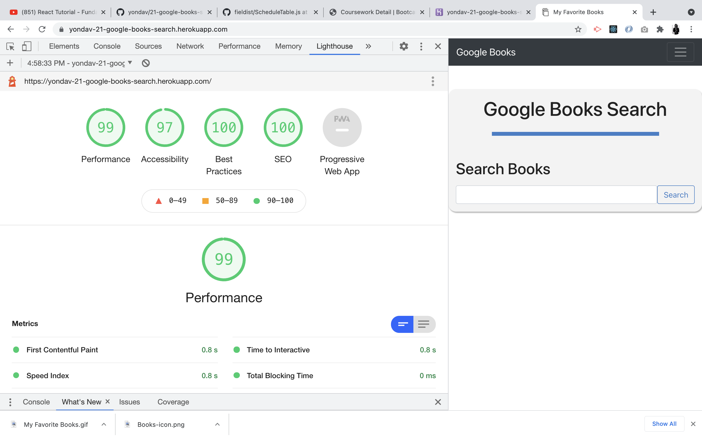

# My Favorite Books/ 21-google-books-search

[](https://opensource.org/licenses/MIT)

<div align="center">
  <div>
    <a href="https://github.com/yondav/21-google-books-search" alt"repo">
      
      <p align=left>&nbsp;&nbsp;Repo</p>
    </a>
  </div>
  <a href="https://yondav-21-google-books-search.herokuapp.com/" alt"deployed">
    
  </a>
</div>
<br />

<br />

## About / Synopsis

<br />
<div align="center">
  <p>
    My Favorite Books is an interactive web application built using the MERN stack and powered by <a href="https://developers.google.com/books" alt="Google Books API">Google Books</a>. The user has access to all books in the Google Books API via a query field with the ability to save books to an internal database and remove saved books.
  </p>
</div>
<br />

---

<br />

## Table of Contents

<br/>

> - [Title / Repository Name](#title--repository-name)
>   - [About / Synopsis](#about--synopsis)
>   - [Table of Contents](#table-of-contents)
>   - [Installation](#installation)
>   - [Usage](#usage)
>   - [Demo](#demo)
>   - [Author](#author)
>     - [Contact](#contact)
>   - [Contributing / Issues](#contributing--issues)
>     - [Contributing](#contributing)
>     - [Reporting Issues](#reporting-issues)
>   - [License](#licenses)

<br />

---

<br />

## Installation

<br />

Should you decide to clone the repo, you will have to install dependencies in the `root` directory and inside the `client` directory.

<br />

```
npm i
```

<br />

You'll also need to configure the `.env.EXAMPLE` file in the `root` directory.

<br />

```
API_KEY=<your google api key>
```

<br />

---

<br />

## Usage

<br />

Once all dependencies are installed, you will be able to run the react app from the server side by running `npm start` in the `root` directory.

<br />

---

<br />

## Demo

<br />

<div align="center">
  
</div>

<br />

<div align="center">
  
</div>

<br/>

---

<br />

## Author

<br />

### Yoni David

<br />

- <a href="https://yondav.us/">Portfolio</a>
- <a href="https://github.com/yondav">Github</a>

<br />

---

<br />

### Contact

<br />

Inquiries can be sent to [yoni@yondav.com](mailto:yoni@yondav.com)

<br />

## Contributing / Issues

<br />

### Contributing

<br />

- Fork repo
- Make additions and changes on new, personalized branch
- Submit [pull request](https://github.com/yondav/21-google-books-search)

<br />

---

<br />

### Reporting Issues

<br />

Report issues by selecting the [issues](https://github.com/yondav/21-google-books-search) tab and creating a new issue

<br />

---

<br />

## Licenses

<br />

- [MIT](https://github.com/yondav/21-google-books-search/blob/main/LICENSE)

<br />

---

<br />

<div align="center">
  
  <br />
  
  
  
  
  
  <p>This README file was built with 
    <a href="https://github.com/yondav/README-gen-09">README GENERATOR</a>
  </p>
  <p>Copyright &copy; 2021, Yoni David<p>
</div>
